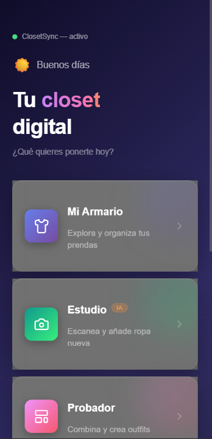
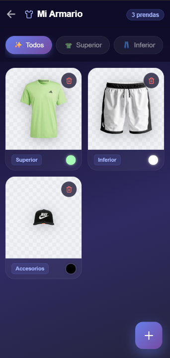
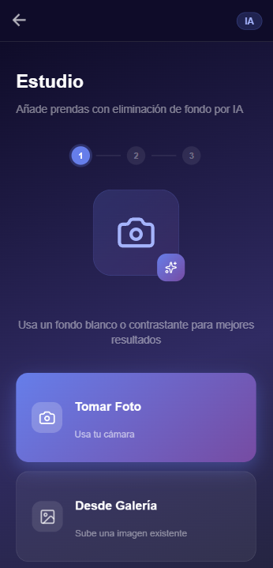
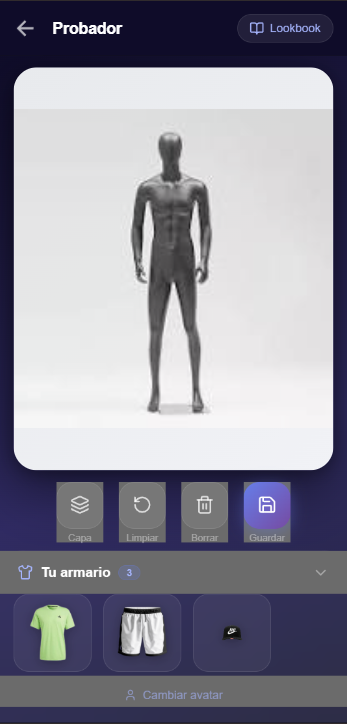
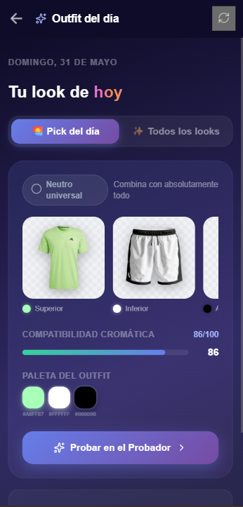
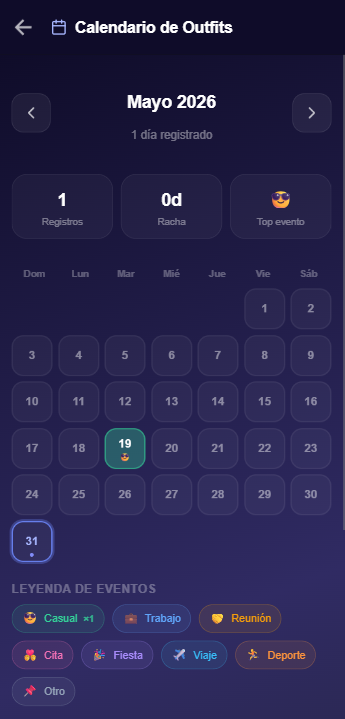
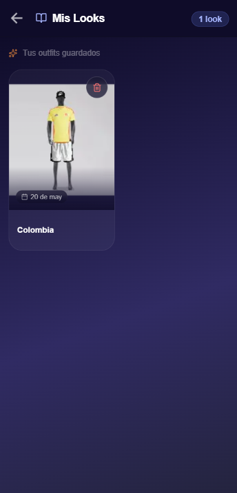
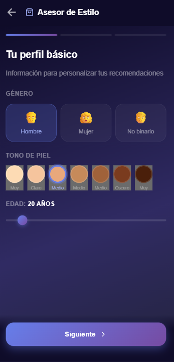
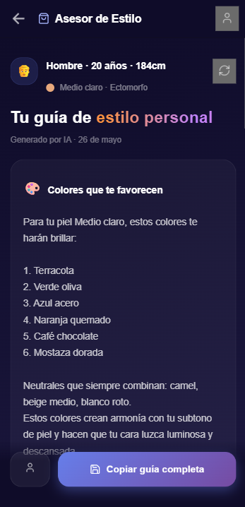

# ClosetSync — Armario Inteligente con IA

> Plataforma móvil para gestión de vestuario personal. Digitaliza tu ropa con eliminación de fondo por IA, genera outfits armónicos basados en teoría de color, registra tu historial de looks y recibe recomendaciones de compra personalizadas según tu tipo de cuerpo y tono de piel — todo bajo una estética Dark Luxury Premium.

---

## 📸 Capturas de Pantalla

<div align="center">

| Dashboard | Mi Armario | Estudio IA |
|:---:|:---:|:---:|
|  |  |  |

<br>

| Probador | Outfit del Día | Calendario |
|:---:|:---:|:---:|
|  |  |  |

<br>

| Lookbook | Asesor de Estilo | Style Advisor |
|:---:|:---:|:---:|
|  |  |  |

</div>

---

## Tabla de Contenidos

- [Descripción General](#descripción-general)
- [Stack Tecnológico](#stack-tecnológico)
- [Arquitectura](#arquitectura)
- [Funcionalidades](#funcionalidades)
- [Requisitos Funcionales](#requisitos-funcionales)
- [Requisitos No Funcionales](#requisitos-no-funcionales)
- [Reglas de Negocio](#reglas-de-negocio)
- [Diseño de la Interfaz](#diseño-de-la-interfaz)
- [Instalación y Configuración](#instalación-y-configuración)
- [Variables de Entorno](#variables-de-entorno)
- [Estructura del Proyecto](#estructura-del-proyecto)
- [Motor de Color](#motor-de-color)
- [Base de Datos Local](#base-de-datos-local)
- [Seguridad y Privacidad](#seguridad-y-privacidad)

---

## Descripción General

**ClosetSync** es una aplicación móvil 100% local construida con **Ionic React** que digitaliza y gestiona el armario personal de un usuario. Permite fotografiar prendas con eliminación automática del fondo, organizar el vestuario por categorías y colores, generar combinaciones de outfits basadas en teoría cromática, y llevar un registro histórico del uso diario de cada look.

### ¿Qué problema resuelve?

- **Sin la app:** prendas olvidadas en el fondo del armario, outfits repetidos en reuniones importantes, compras impulsivas que no combinan con lo que ya tienes, sin visibilidad del vestuario completo.
- **Con la app:** catálogo visual digitalizado con fondo eliminado por IA, recomendador de outfits por armonía cromática, historial de uso con heatmap mensual, alertas de repetición en eventos de trabajo, y guía de compras personalizada según tono de piel y contextura corporal.

---

## Stack Tecnológico

### Frontend (único layer — app 100% offline)

| Tecnología | Uso |
|------------|-----|
| **Ionic React** | Framework móvil multiplataforma (iOS / Android / PWA) |
| **TypeScript** | Tipado estático en toda la capa de presentación |
| **Tailwind CSS** | Sistema de utilidades de layout y espaciado |
| **CSS-in-JS (inline `<style>`)** | Animaciones GPU-friendly y sistema Dark Luxury |
| **Fabric.js** | Canvas interactivo para el Probador Virtual |
| **Capacitor Core** | Bridge nativo para cámara, filesystem y notificaciones |
| **@capacitor/camera** | Captura de foto y acceso a galería |
| **@capacitor/local-notifications** | Notificaciones push locales diarias (7am) |
| **lucide-react** | Sistema de iconografía consistente |
| **Web Canvas API** | Extracción de color dominante por muestreo de píxeles |

### Servicios Externos

| Servicio | Uso | Requiere key |
|----------|-----|:---:|
| **remove.bg API** | Eliminación profesional de fondo de prendas | ✅ |
| **localStorage** | Persistencia de perfil de estilo, calendario y preferencias | ❌ |
| **SQLite / Mock DB** | Almacenamiento local de prendas y outfits | ❌ |

---

## Arquitectura

```
┌──────────────────────────────────────────────────────────┐
│                    CLIENTE MÓVIL                         │
│            Ionic React (iOS / Android / PWA)             │
│                                                          │
│  ┌──────────┐ ┌──────────┐ ┌──────────┐ ┌───────────┐   │
│  │Dashboard │ │ Closet   │ │ Studio   │ │FittingRoom│   │
│  └──────────┘ └──────────┘ └──────────┘ └───────────┘   │
│  ┌──────────┐ ┌──────────┐ ┌──────────┐ ┌───────────┐   │
│  │DailyOut. │ │Calendar  │ │ Lookbook │ │StyleAdvis.│   │
│  └──────────┘ └──────────┘ └──────────┘ └───────────┘   │
│                                                          │
│  ┌───────────────────────┐  ┌────────────────────────┐   │
│  │   colorEngine.ts      │  │  notificationService   │   │
│  │  (HSL math, offline)  │  │  (@cap/local-notifs)   │   │
│  └───────────────────────┘  └────────────────────────┘   │
└─────────────────────┬──────────────────────┬─────────────┘
                      │ HTTPS POST           │ localStorage
         ┌────────────▼──────────┐  ┌────────▼────────────┐
         │    remove.bg API      │  │  SQLite / Mock DB   │
         │  (eliminación fondo)  │  │  prendas + outfits  │
         └───────────────────────┘  └─────────────────────┘
```

---

## Funcionalidades

### Gestión del Armario
- **Estudio con IA** — Fotografía prendas con la cámara o sube desde galería; remove.bg elimina el fondo automáticamente; el color dominante se detecta por muestreo de píxeles sin APIs adicionales
- **Armario digital** — Cuadrícula visual con fondo tipo tablero de ajedrez para mostrar transparencia; filtros por categoría (Superior, Inferior, Calzado, Accesorios); eliminación con animación de salida
- **Metadatos automáticos** — Categoría, color dominante detectado por IA, fecha de creación

### Probador Virtual
- **Canvas Fabric.js interactivo** — Arrastra, escala y rota cada prenda sobre tu foto o un maniquí
- **Avatar personalizable** — Usa tu propia foto o elige entre maniquíes predefinidos
- **Controles de lienzo** — Llevar al frente, limpiar canvas, eliminar prenda seleccionada
- **Guardar en Lookbook** — Exporta el canvas como imagen WebP y guarda el JSON de estado para edición futura

### Outfit del Día (IA cromática)
- **Pick diario determinístico** — El algoritmo usa la fecha como semilla para seleccionar el mismo outfit todo el día, cambiando cada medianoche
- **Recomendador de armonías** — Genera hasta 12 combinaciones ordenadas por score de compatibilidad cromática (0–100) usando matemáticas HSL
- **Tipos de armonía** — Complementario, Análogo, Triádico, Split-complementario, Neutro
- **Integración con Probador** — "Probar" carga automáticamente las prendas del outfit seleccionado en el canvas del Probador

### Calendario de Outfits
- **Heatmap mensual** — Vista tipo GitHub con celdas coloreadas por tipo de evento (casual, trabajo, reunión, cita, fiesta, viaje, deporte)
- **Registro diario** — Selecciona el outfit usado desde el Lookbook, añade etiqueta de evento y nota libre
- **Detector de repetición** — Alerta automática si usaste el mismo outfit en los últimos 14 días, con advertencia especial si el día anterior fue también una reunión o trabajo
- **Estadísticas mensuales** — Total de registros, racha de días consecutivos y evento más frecuente

### Asesor de Estilo Personal
- **Perfil en 3 pasos** — Género, edad, tono de piel (7 tonos con swatches reales), altura (slider 140–210cm), tipo de cuerpo (7 siluetas con descripción)
- **Motor local de conocimiento** — 100% offline; tablas de estilismo profesional que cruzan tono de piel × tipo de cuerpo × altura para generar guías en 7 secciones
- **7 secciones de recomendación** — Colores que favorecen, colores a evitar, siluetas ideales, lista de 8 prendas a comprar, errores comunes, accesorios, consejo personal motivador
- **Persistencia del perfil** — Se guarda en `localStorage`; nunca vuelve a pedir los datos al usuario

### Lookbook
- **Galería de outfits guardados** — Grid 2 columnas con imagen preview en aspect ratio 3:4
- **Metadatos** — Nombre del look, fecha de creación con badge flotante sobre imagen
- **Eliminación animada** — `scaleOut` antes de remover del DOM; entrada escalonada en cada carga
- **Integración con Calendario** — Los outfits del Lookbook son seleccionables al registrar un día en el calendario

### Notificaciones Push Diarias
- **Alerta a las 7am** — Notificación local recurrente usando `@capacitor/local-notifications`
- **Canal Android** — Canal dedicado "Outfit del día" con vibración y luz LED índigo
- **Toggle en la app** — Activar/desactivar desde la página Outfit del Día sin salir de la app
- **Tap handler** — Al tocar la notificación navega directo a `/daily-outfit`

---

## Requisitos Funcionales

### RF-01 — Captura y Procesamiento de Prendas
Al subir una imagen:
1. Se envía el blob de la imagen a `api.remove.bg/v1.0/removebg`
2. Se recibe la imagen con fondo transparente (PNG)
3. Se extrae el color dominante con Web Canvas API (muestreo de píxeles, sin APIs externas)
4. El usuario puede ajustar manualmente el color y seleccionar la categoría
5. La prenda se persiste en SQLite con URI de imagen en Base64

### RF-02 — Motor de Recomendación Cromática
El sistema genera outfits combinando prendas del armario según armonía de color:
1. Convierte todos los `color_tag` hex → HSL
2. Construye combinaciones válidas: al menos un Superior + un Inferior
3. Calcula score promedio de todos los pares de la combinación usando diferencia de hue
4. Aplica bonus de contraste por diferencia de luminosidad (L > 20 → +5 pts)
5. Ordena por score y deduplica por conjunto de IDs

Tipos de armonía por diferencia de hue:

| Rango de diferencia | Tipo |
|---------------------|------|
| 0° – 35° | Análogo |
| 110° – 130° | Triádico |
| 140° – 160° | Split-complementario |
| 145° – 215° | Complementario |
| Saturación < 15% | Neutro universal |

### RF-03 — Pick Diario Determinístico
```
seed = año × 10000 + mes × 100 + día
random(seed) → índice en el pool de top-10 sugerencias
→ mismo resultado en todos los dispositivos para esa fecha
```

### RF-04 — Probador Virtual con Canvas
Al entrar desde Outfit del Día:
1. `sessionStorage.fitting_preload` contiene los IDs del outfit seleccionado
2. `FittingRoom` lo lee y elimina el item inmediatamente al entrar
3. Filtra el carrusel inferior solo con esas prendas
4. Una vez el avatar carga en el canvas, espera 400ms y auto-agrega las prendas con stagger de 120ms
5. Posiciones automáticas según cantidad: 2 prendas (izquierda/derecha), 3 (triángulo), 4 (cuadrícula 2×2)

### RF-05 — Registro de Calendario con Detección de Repetición
Al seleccionar un outfit para un día:
1. Se buscan entradas de los últimos 14 días con el mismo `outfitId`
2. Si existe coincidencia → alerta naranja con días transcurridos
3. Si el día anterior era `reunión` o `trabajo` → advertencia adicional de cliente potencial
4. El registro se persiste en `localStorage` bajo la clave `outfit_calendar_entries`

### RF-06 — Notificación Push Recurrente
```
proximaAlarma = hoy a las 07:00:00
si ya pasaron las 7am → mañana a las 07:00:00
schedule({ at: proximaAlarma, repeats: true, every: "day" })
```

### RF-07 — Motor de Asesor de Estilo (100% Local)
```
SKIN_COLOR_MAP[skinTone]   → colores ideales, a evitar, neutros
BODY_STYLE_MAP[bodyType]   → siluetas, prendas, errores, accesorios
heightAdvice(heightCm)     → reglas especiales por estatura
→ texto fluido en 7 secciones, generado en < 800ms
```

---

## Requisitos No Funcionales

### RNF-01 — Animaciones GPU-only (Crítico para rendimiento móvil)
Todas las animaciones usan exclusivamente `transform` y `opacity`. Ningún cambio de `width`, `height`, `top`, `left` ni `margin` en keyframes. Esto garantiza 60fps en dispositivos de gama media.

### RNF-02 — Cero APIs para Funciones Core
Las funciones de recomendación, detección de color, generación de outfits, calendario y asesor de estilo funcionan **100% offline**. Solo `remove.bg` requiere conexión (captura de prendas).

### RNF-03 — Eliminación Animada antes de Mutación de Estado
Toda eliminación (prenda, outfit, entrada de calendario) ejecuta la animación de salida (`scaleOut`, 280ms) **antes** de llamar a la función de borrado en la BD/localStorage. El estado no muta hasta que la animación completa.

### RNF-04 — sessionStorage como Canal de Comunicación entre Páginas
Los parámetros de navegación entre páginas (preload de prendas para el Probador) viajan via `sessionStorage` y se eliminan en el primer `useIonViewWillEnter` del receptor. Esto evita que datos obsoletos persistan entre sesiones.

### RNF-05 — Stagger de Animaciones para Listas
Las grillas de prendas y outfits usan `animation-delay` incremental (`nth-child` × 40ms) para dar efecto de cascada de entrada sin bloquear el hilo principal.

### RNF-06 — Compatibilidad Web + Nativo
Todos los servicios verifican `Capacitor.isNativePlatform()` antes de llamar APIs nativas:
- Notificaciones → fallback a `Notification` API del navegador
- Imágenes → `Capacitor.convertFileSrc()` en nativo, URL directa en web

---

## Reglas de Negocio

| # | Regla |
|---|-------|
| **RN-01** | Un outfit sugerido debe tener al menos una prenda Superior (cat. 1) y una Inferior (cat. 2) |
| **RN-02** | El pick diario es idéntico para el mismo usuario durante todo el día natural (00:00–23:59) |
| **RN-03** | El color dominante se detecta ignorando píxeles con alpha < 128 (transparentes) y píxeles con saturación < 8% (grises/blancos/negros) |
| **RN-04** | Solo se puede registrar un outfit por día en el calendario; registrar uno nuevo sobreescribe el anterior |
| **RN-05** | La alerta de repetición solo aplica en ventana de 14 días hacia atrás, nunca hacia el futuro |
| **RN-06** | El perfil del Asesor de Estilo se guarda en `localStorage` y se pre-carga silenciosamente; el formulario de 3 pasos no se vuelve a mostrar si ya existe un perfil guardado |
| **RN-07** | Las prendas eliminadas liberan su Blob URL (`URL.revokeObjectURL`) antes de ser removidas del estado para evitar memory leaks |
| **RN-08** | El canvas del Probador se dispone (`canvas.dispose()`) en el cleanup de `useEffect` para liberar la memoria de WebGL al desmontar el componente |

---

## Diseño de la Interfaz

La app implementa el sistema de diseño **Dark Luxury Premium**, coherente en todas las vistas.

### Sistema de Color

| Token | Valor | Uso |
|-------|-------|-----|
| `background-deep` | `#0f0c29` | Fondo base de todas las pantallas |
| `background-mid` | `#302b63` | Gradiente intermedio |
| `background-dark` | `#24243e` | Gradiente final |
| `accent-indigo` | `#667eea → #764ba2` | Acciones primarias, botones, anillos |
| `accent-teal` | `#11998e → #38ef7d` | Estudio / IA |
| `accent-pink` | `#f093fb → #f5576c` | Probador / Lookbook |
| `accent-amber` | `#f7971e → #ffd200` | Outfit del Día |
| `accent-cyan` | `#4facfe → #00f2fe` | Calendario |
| `accent-rose` | `#fa709a → #fee140` | Asesor de Estilo |
| `surface-glass` | `rgba(255,255,255,0.04)` | Cards principales |
| `surface-border` | `rgba(255,255,255,0.08)` | Bordes de cards |
| `text-primary` | `#ffffff` | Títulos y valores |
| `text-secondary` | `rgba(255,255,255,0.45–0.55)` | Labels y descripciones |
| `text-muted` | `rgba(255,255,255,0.25–0.35)` | Metadatos y hints |
| `indigo-soft` | `#a5b4fc` | Badges, iconos activos, links |
| `success` | `#34d399` | Colores detectados, estados ok |
| `warning` | `#f59e0b` | Alertas de repetición |
| `danger` | `#f87171` | Botones de eliminar, errores |

### Tipografía

La app usa las fuentes del sistema más Tailwind sin cargar fuentes externas, pero está preparada para:

| Familia recomendada | Peso | Uso |
|---------------------|------|-----|
| **Inter / System UI** | 700–800 | Títulos, números, temporizadores |
| **Inter** | 500–600 | Labels en caps (`tracking-wider`) |
| **Inter** | 400 | Cuerpo de texto, notas, descripciones |

### Glass Card (base)

```css
background: rgba(255, 255, 255, 0.04);
border: 1px solid rgba(255, 255, 255, 0.08);
border-radius: 20px;
backdrop-filter: blur(12px);
box-shadow: 0 8px 32px rgba(0, 0, 0, 0.3),
            inset 0 1px 0 rgba(255, 255, 255, 0.06);
```

### Checkered Background (preview de prendas)

```css
background-color: #f1f2f6;
background-image:
  linear-gradient(45deg, #e8eaed 25%, transparent 25%),
  linear-gradient(-45deg, #e8eaed 25%, transparent 25%),
  linear-gradient(45deg, transparent 75%, #e8eaed 75%),
  linear-gradient(-45deg, transparent 75%, #e8eaed 75%);
background-size: 16px 16px;
background-position: 0 0, 0 8px, 8px -8px, -8px 0px;
```

### Paleta de Tipos de Evento (Calendario)

| Tipo | Emoji | Color |
|------|-------|-------|
| Casual | 😎 | Verde `#34d399` |
| Trabajo | 💼 | Azul `#60a5fa` |
| Reunión | 🤝 | Ámbar `#f59e0b` |
| Cita | 💑 | Rosa `#f472b6` |
| Fiesta | 🎉 | Violeta `#a78bfa` |
| Viaje | ✈️ | Cyan `#38bdf8` |
| Deporte | 🏃 | Naranja `#fb923c` |
| Otro | 📌 | Gris `#94a3b8` |

### Paleta de Armonías de Color

| Tipo | Emoji | Color de badge |
|------|-------|----------------|
| Complementario | ⚡ | Ámbar `#f59e0b` |
| Análogo | ☀️ | Esmeralda `#34d399` |
| Triádico | 🔲 | Violeta `#a78bfa` |
| Split-comp | ✨ | Rosa `#f472b6` |
| Neutro | ⭕ | Slate `#94a3b8` |

---

## Instalación y Configuración

### Requisitos Previos

- Node.js `>= 18`
- Ionic CLI: `npm install -g @ionic/cli`
- Capacitor CLI: incluido con Ionic
- Android Studio (para build nativo Android)
- Xcode `>= 14` (para build nativo iOS — solo macOS)

### Instalación

```bash
git clone https://github.com/tu-usuario/closetsync.git
cd closetsync
npm install
```

### Dependencias clave adicionales

```bash
npm install @capacitor/camera @capacitor/local-notifications
npm install fabric lucide-react
npx cap sync
```

### Desarrollo Web

```bash
ionic serve
# Abre en http://localhost:5173
```

### Build Nativo

```bash
# Android
ionic cap run android --livereload

# iOS
ionic cap run ios --livereload
```

### Configuración de remove.bg

En `src/pages/Studio.tsx`, reemplaza la API key:

```typescript
headers: {
  "X-Api-Key": "TU_API_KEY_REMOVE_BG",  // ← obtén una gratis en remove.bg
}
```

Tier gratuito de remove.bg: **50 créditos/mes** (1 crédito = 1 imagen procesada).

---

## Variables de Entorno

ClosetSync no requiere variables de entorno obligatorias ya que es una aplicación completamente local. La única configuración sensible es:

```typescript
// src/pages/Studio.tsx
const REMOVE_BG_API_KEY = "TU_KEY_AQUI";

// Opcional: mover a .env para producción
// .env
VITE_REMOVE_BG_KEY=tu_key_aqui

// Uso en código
const key = import.meta.env.VITE_REMOVE_BG_KEY;
```

> ⚠️ Agrega `.env` a tu `.gitignore` antes de hacer commit para no exponer la key.

---

## Estructura del Proyecto

```
closetsync/
└── src/
    ├── pages/
    │   ├── Dashboard.tsx          # Hub principal con saludo dinámico y stats
    │   ├── Closet.tsx             # Armario: grid con filtros y heatmap de colores
    │   ├── Studio.tsx             # Captura → remove.bg → detección de color → guardado
    │   ├── FittingRoom.tsx        # Canvas Fabric.js + avatar + preload desde DailyOutfit
    │   ├── Lookbook.tsx           # Galería de outfits guardados
    │   ├── DailyOutfit.tsx        # Pick diario + tab de sugerencias + notif toggle
    │   ├── OutfitCalendar.tsx     # Heatmap mensual + DaySheet + detector repetición
    │   └── StyleAdvisor.tsx       # Perfil 3 pasos + motor local de recomendaciones
    │
    ├── utils/
    │   └── colorEngine.ts         # Motor HSL: extracción, armonías, scoring, picks
    │
    ├── services/
    │   └── notificationService.ts # Schedule 7am, cancel, channels, tap handler
    │
    ├── database/
    │   └── dbService.ts           # Adaptador SQLite/Mock: prendas, outfits, avatar
    │
    └── App.tsx                    # Router + rutas protegidas
```

---

## Motor de Color

El archivo `src/utils/colorEngine.ts` es el núcleo de inteligencia de la app. Funciona **100% offline** sin ninguna API externa.

### Funciones exportadas

| Función | Descripción |
|---------|-------------|
| `extractDominantColor(imageUrl)` | Muestrea píxeles del canvas, agrupa por hue en 12 buckets de 30°, retorna el hex dominante |
| `generateOutfitSuggestions(garments, n)` | Construye todas las combinaciones válidas y retorna las top-N ordenadas por score |
| `pickDailyOutfit(garments)` | Selección determinística por fecha como semilla (LCG) |
| `scoreGarmentPair(colorA, colorB)` | Retorna tipo de armonía y score 0–100 para un par de colores |
| `generateHarmonyPalette(baseHex)` | Genera las 5 paletas armónicas a partir de un color base |

### Algoritmo de extracción de color dominante

```
1. Cargar imagen en canvas offscreen (escalada a √sampleSize píxeles)
2. Iterar píxeles RGBA:
   - Saltar alpha < 128  (transparentes — fondo removido)
   - Saltar saturación < 8%  (grises, blancos, negros)
   - Saltar luminosidad < 8% o > 92%  (demasiado oscuro/claro)
3. Asignar cada píxel a uno de 12 buckets de hue (0°–359° / 30°)
4. Promediar R, G, B del bucket más poblado
5. Retornar como hex "#rrggbb"
```

### Cálculo de score entre prendas

```
score_par = HARMONY_META[tipo].score_base
          + (|L_a - L_b| > 20 ? 5 : 0)   // bonus contraste

score_outfit = promedio de todos los pares
             + (prendas >= 3 ? 5 : 0)      // bonus completitud
             (máximo 100)
```

---

## Base de Datos Local

ClosetSync usa un adaptador `dbService.ts` que abstrae entre SQLite nativo (Capacitor) y localStorage/mock para entornos web.

### Estructura lógica

```
garments
  id            UUID
  category_id   INT (1=Superior, 2=Inferior, 3=Calzado, 4=Accesorio)
  image_uri     TEXT (Base64 en web, file path en nativo)
  color_tag     TEXT (hex "#rrggbb" — auto-detectado por IA)
  created_at    ISO 8601

outfits
  id            UUID
  name          TEXT
  canvas_json   TEXT (estado serializado de Fabric.js)
  preview_image TEXT (Base64 WebP 50% calidad)
  created_at    ISO 8601

user_profile
  avatar        TEXT (Base64 DataURL de la foto del usuario)

outfit_calendar_entries               ← localStorage
  id            UUID
  date          "YYYY-MM-DD"
  outfitId      UUID | null
  garmentIds    UUID[]
  eventTag      EventTag
  note          TEXT (max 200 chars)
  previewImage  TEXT

style_advisor_profile                 ← localStorage
  skinTone      SkinTone (7 valores)
  bodyType      BodyType (7 valores)
  heightCm      INT (140–210)
  gender        "hombre" | "mujer" | "no_binario"
  age           INT
  preferences   TEXT (max 500 chars)
```

### Categorías de prendas

| ID | Nombre | Rol en outfits |
|----|--------|----------------|
| 1 | Superior | Obligatorio (tops, camisas, chaquetas) |
| 2 | Inferior | Obligatorio (pantalones, faldas) |
| 3 | Calzado | Opcional — añade al score si combina |
| 4 | Accesorio | Opcional — gorros, bolsos, cinturones |

---

## Seguridad y Privacidad

- **Todas las imágenes permanecen en el dispositivo** — nunca se envían a ningún servidor propio; la única excepción es remove.bg (solo durante el proceso de captura)
- **Blob URLs se liberan explícitamente** con `URL.revokeObjectURL()` al desmontar o eliminar prendas para prevenir memory leaks
- **No hay autenticación** — la app es monousuario y local por diseño
- **`sessionStorage` se limpia** en el primer render del receptor para evitar datos residuales entre sesiones de navegación
- **API key de remove.bg** debe almacenarse en `.env` y nunca commitearse al repositorio
- **Sin telemetría** — la app no envía datos de uso, analytics ni crashreports a ningún tercero

---

## Licencia

Este proyecto está bajo la Licencia MIT. Consulta el archivo `LICENSE` para más detalles.

---

*Desarrollado por Yerson Rodriguez*

**Hecho para personas que quieren sacarle el máximo partido a su armario sin esfuerzo.**